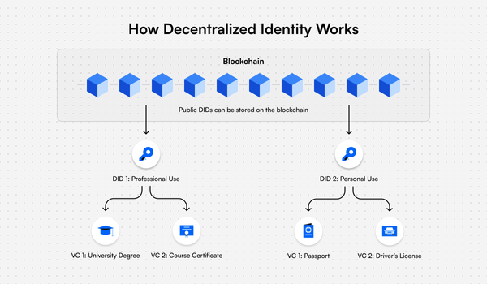

# Decentralized ID <!-- omit in toc -->

[](https://opensource.org/licenses/MIT)
Published on [GitHub](https://github.com/)

<div align="center">
  
</div>

- [Summary](#summary)
- [DID in the Aleo blockchain](#did-in-the-aleo-blockchain)
- [Running the Program](#running-the-program)
  - [Configuring Accounts](#configuring-accounts)
  - [Building the Program](#building-the-program)
  - [Providing inputs via the command line](#providing-inputs-via-the-command-line)
  - [Using an input file](#using-an-input-file)
  - [Create Id](#create-id)
  - [Publish root associated to ID](#publish-root-associated-to-id)
  - [Bind proof associated to root](#bind-proof-associated-to-root)

## Summary

The decentralized identity is a digital form of identity in a decentralized manner where the users have control over their own personal information, rather than having it controlled by a central organization or company. With decentralized identity management, users have the ability to control who has access to their personal information, and can easily revoke access if necessary.

In this model, there are two main elements: Decentralized Identifier (DID) and Verifiable Credential (VC):
- **DID**: A unique identifier on the blockchain made up of a string of letters and numbers that contains details like the public key and verification information.
- **VC**: A digital, cryptographically secured version of both paper and digital credentials that people can present to organizations that need them for verification. These are the main parties in the VC system: the holder, the issuer and the verifier.
  - *Holder*: A user who creates their decentralized identifier with a digital wallet app and receives the Verifiable Credential.
  - *Issuer*: The organization that signs a Verifiable Credential with their private key and issues it to the holder.
  - *Verifier*: A party that checks the credentials and can read the issuer’s public DID on the blockchain to verify if the Verifiable Credential the holder shared was signed by the issuer’s DID.

We make following assumptions about the decentralized identity system:
- The holder creates their decentralized identifier with a digital wallet by invoking the `create_id` function.
- The issuer can be the individual or the organization. They publish credential data related to their ID to the blockchain by invoking `publish_root` function. For instance, an individual publishes their personal info in terms of credential that can be used to gain access to their info. And a licensing organization provides a credential of the holders like a driver's license and then the driver can bind their license to the organization by invoking `bind_proof` function. The driver can use the proof record of their license as credential to verify or gain their access.

## DID in the Aleo blockchain
- The dencentralized identity system is secured by implementing core concept of Aleo: security, private, decentralized, trustless,...Both Id and credential root are published in terms of ciphertext and only decrypt by user's view key.

## Running the Program

Leo provides users with a command line interface for compiling and running Leo programs.
Users may either specify input values via the command line or provide an input file in `inputs/`.

### Configuring Accounts
The `program.json` file contains a private key and address. 
This is the account that will be used to sign transactions and is checked for record ownership.
When executing programs as different parties, be sure to set the `private_key` and `address` fields in `program.json` to the appropriate values.
```json
{
  "program": "id.aleo",
  "version": "0.0.0",
  "description": "Decentralized Identity",
  "development": {
      "private_key": "APrivateKey1zkp8wYsJ79xGvGMSQBkh2VLo3NxPZajbQZiZ2zbTVPmBAau",
      "address": "aleo1vw7q53aea30xlk57fu6gnhdgcwqvh9arxcka30rctldmly67vugqk5zgpx"
  },
  "license": "MIT"
}
```
See `./run.sh` for an example of how to run the program as different parties.

### Building the program

To compile this Leo program, run:
```bash
leo build
```

### Providing inputs via the command line.
1. Run
```bash
leo run <function_name> <input_1> <input_2> ...
```
See `./run.sh` for an example.


### Using an input file.
1. Modify `inputs/id.in` with the desired inputs.
2. Run
```bash
leo run <function_name>
```

### Create Id
Create Id for this account `aleo1vw7q53aea30xlk57fu6gnhdgcwqvh9arxcka30rctldmly67vugqk5zgpx`

**Run**
```
leo run create_id
```

**Output**
```bash
{
  creator: aleo1vw7q53aea30xlk57fu6gnhdgcwqvh9arxcka30rctldmly67vugqk5zgpx,
  id: 10010055439917326779u64
}
```

### Publish root associated to ID
Publish this root `17646029704403646329262977545885904155278938368574073463104538741215567924227field` associated to this account `aleo1vw7q53aea30xlk57fu6gnhdgcwqvh9arxcka30rctldmly67vugqk5zgpx`

**Run**
```
leo run publish_root 17646029704403646329262977545885904155278938368574073463104538741215567924227field
```

### Bind proof associated to root
Bind this proof `17646029704403646329262977545885904155278938368574073463104538741215567924227field` associated to this root `17646029704403646329262977545885904155278938368574073463104538741215567924227field`

**Run**
```
leo run bind_proof 17646029704403646329262977545885904155278938368574073463104538741215567924227field 17646029704403646329262977545885904155278938368574073463104538741215567924227field
```

**Output**
```bash
{
  owner: aleo1vw7q53aea30xlk57fu6gnhdgcwqvh9arxcka30rctldmly67vugqk5zgpx.private,
  proof: 757106205546905480765327668322811092527139698265945807234071829380749446145field.private,
  _nonce: 2689819217668576743365574382169295401837283620535877699423830743635502680372group.public
}
```